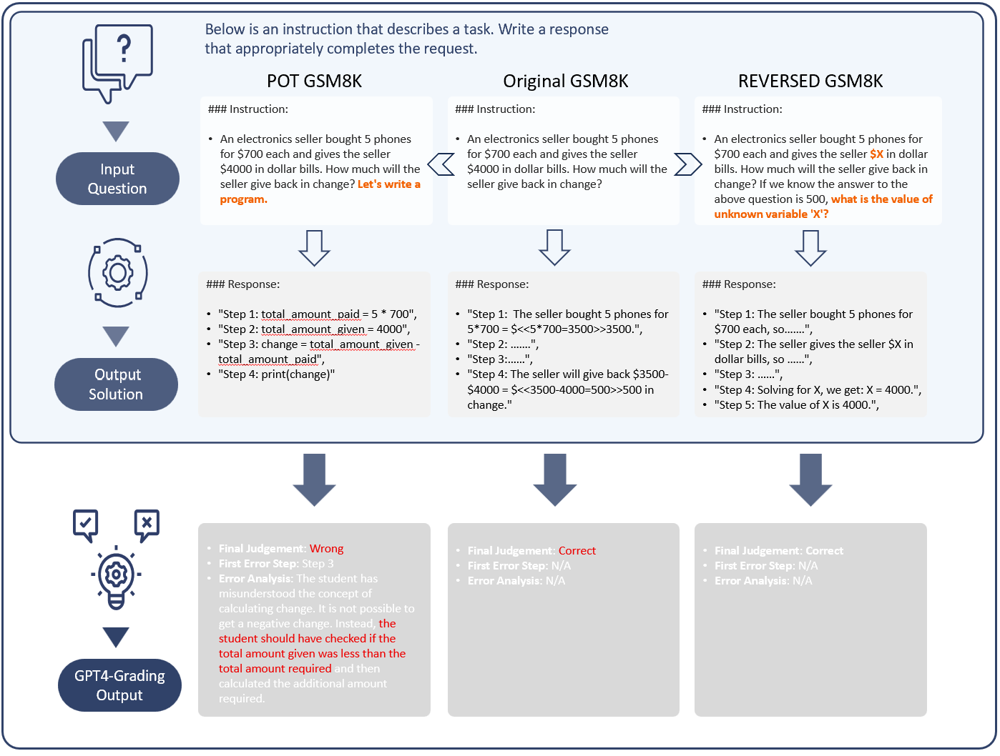

# MR-GSM8K - A Novel Benchmark for Evaluating Reasoning in LLMs
[](CODE_LICENSE)
[](https://www.python.org/downloads/release/python-390/)

<p align="center">
🤗 <a href="https://huggingface.co/datasets/Randolphzeng/DiagGSM8K" target="_blank">HF Dataset</a> • 📃 <a href="https://arxiv.org/abs/2312.17080" target="_blank"> Arxiv Paper </a><br>
</p>

Welcome to the official repository for the MR-GSM8K dataset and related research. This repository serves as a hub for resources associated with our recent publication "MR-GSM8K: A Meta-Reasoning Revolution in Large Language Model Evaluation".
We encourage other SOTA Math LLMS to try out our benchmark and return its results to us. We would be happy to include it in the `eval_results` and update the evaluation tables below for you.

## News
[2024.01.19] We submitted our second draft of MR-GSM8K(renamed from DiagGSM8k) paper with minor cleaning of the dataset and introduced our novel metrics MR-Score. This update is mainly for naming consistency for the future expansion to more subjects and different difficulties. Please rest in sure that this should be our (hopefully) last major updates on the repo config and we are sorry for the confusion!

[2024.01.07] We are working hard on creating a more holistic and multifaceted evaluation benchmark that broadens the scope and difficulty levels of current MR-GSM8K. Please stay tuned and consider adding a star for updates.

[2023.12.28] We submitted our first draft of MR-GSM8k paper and also open-sourced the benchmark and its evaluation results

## About the Evaluation Benchmark

MR-GSM8K is a challenging benchmark designed to evaluate the meta-reasoning capabilities of state-of-the-art Large Language Models (LLMs). It goes beyond traditional evaluation metrics by focusing on the reasoning process rather than just the final answer, thus offering a more nuanced assessment of a model's cognitive abilities.

Specifically, given a GSM8K question and its solution, the evaluated model is tasked to predict the correctness of the solution. If the solution is incorrect, the model is expected to further locate the first error location and elucidate the error reason. Note that each test problem is combined with two variations which requires code solution and backward reasoning.



## Our Evaluation Metric MR-Score
In order to provide a unified and normalized score to reflect the overall competence of the evaluated model, we hereby propose a novel metric named MR-Score.
MR-Score is a weighted combination of three metrics. The first one is the Matthews Correlation Coefficient (e.g. MCC) for the binary classification of solution correctness. The MCC score ranges from -1 to +1 with -1 means total disagreement between prediction and observation, 0 indicates near random performance and +1 represents perfect prediction. Here we interpret negative values as no better than random guess and set 0 as cut-off threshold for normalization purpose. The second metric is the ratio between numbers of solutions with correct first error step predicted and the total number of incorrect solutions. The third metrics is likewise the ratio between number of solutions with correct first error step plus correct error reason predicted and the total number of incorrect solutions. 

The formula of MR-Score is defined as 
```
MR-Score = w_1 * MCC + w_2 * Accuracy(step) + w_3 * Accuracy(reason)
```
where w_1, w_2, w_3 are chosen empirically. For more discussion on the metrics please refer to section-3 of the paper.

## Evaluation results
Evaluation Results of Models on MR-GSM8k: This table presents a detailed breakdown of each model's performance, including True Positive Rate (TPR), True Negative Rate (TNR) and Matthews Correlation Coefficient. The 'Step' column represents the accuracy of correctly identifying an incorrect solution and pinpointing the first error step. 'S+R/M' column showcased the accuracy of not only locating the first error step in incorrect solutions but also correctly explaining the error's rationale. The overall MR-Score/M is a normalized metric ranges from 0 to 1 and calculated based on formula described in Section-3 of the paper. The M/A here indicate that the error reason is either labelled manually or by by GPT4-Turbo-1106 and MR-Score is calculated based on the respective results. 

| Model           | Eval Method | TPR     | TNR     | MCC   | Step   | S+R/M  | MR-Score/M | MR-Score/A |
|-----------------|-------------|---------|---------|-------|--------|--------|------------|------------|
| Claude2         | 0-shot      | 67.41%  | 67.13%  | 0.345 | 21.04% | 11.76% | 0.191      | 0.203      |
| GPT3-5          | 0-shot      | 78.84%  | 39.48%  | 0.198 | 11.38% | 4.64%  | 0.097      | 0.097      |
| GPT4            | 0-shot      | 69.03%  | 90.59%  | 0.614 | 52.32% | 43.04% | 0.495      | 0.512      |
| WizardMath-70B  | 3-shot      | 82.41%  | 2.73%   | -0.250| 0.38%  | 0.06%  | 0.001      | 0.001      |
| Mammoth-70B     | 3-shot      | 98.81%  | 2.73%   | 0.055 | 0.25%  | 0.06%  | 0.012      | 0.012      |
| MetaMath-70B    | 3-shot      | 91.45%  | 10.55%  | 0.034 | 1.40%  | 0.38%  | 0.013      | 0.013      |
| llama2-70B-diag | 0-shot      | 31.74%  | 73.49%  | 0.058 | 20.79% | 6.29%  | 0.105      | 0.118      |


## Benchmark Details
There are 3000 data instances in the MR-GSM8K benchmark and you can access it at `dataset/MR-GSM8k.json`. Below is the description of the fields in the data instances:
```
{
  'uuid': 'the unique identifier of instance',
  'question': 'the GSM8k question or its variations',
  'ground_truth_solution': 'the ground truth solution for the question',
  'ground_truth_answer': 'the ground truth final answer of the problem',
  'model_output_steps': 'the solution to be graded',
  'model_output_answer_correctness': 'the answer correctness, determined automatically',
  'model_output_solution_correctness': 'the correctness of the solution reasoning process, labelled manually',
  'model_output_solution_first_error_step': 'the first error step of solution. N/A if not applicable, also labelled manually',
  'model_output_solution_first_error_reason': 'the error reason of solution, N/A if not applicable, written manually',
  'question_type': 'original/POT/reversed'
}
```  

## Scripts
To reproduce the results from the paper or test it with your own models, please see `scripts/eval_mr_gsm8k.py` files for more details. 
Here is a high level description of how you can evaluate your models on own dataset with two simple commands:
1. If you are evaluating a local open-sourced model, please consider using vllm library to serve the API requests in OpenAI compatible way, as it is fast and easy to use with a single command:
```
python -u -m vllm.entrypoints.openai.api_server --host 0.0.0.0 --port 10245 --model /absolute/path/to/your/local/model --dtype half --gpu-memory-utilization 0.9  --max-model-len 8192 --tensor-parallel-size 4
```   
2. Now that you have your local model served in an OpenAI API compatible way, we can asynchrounously request your model in a multi-thread way. Use the following command to invoke our eval_mr_gsm8k.py:
```
python scripts/eval_mr_gsm8k.py 
  --diagGSM8k_file_path './dataset/MR-GSM8K.json'   
  --output_dir './eval_results' 
  --eval_base_url 'http://0.0.0.0:10245/v1'  
  --eval_api_key 'placeholder'  
  --eval_model_name '/absolute/path/to/your/local/model' 
  --score_base_url '' 
  --score_api_key 'sk-xxxx' 
  --score_model_name 'gpt-4-turbo'  
  --shot_num 0  
  --max_workers 5   
  --demo_path './dataset/k-shot-demos.json'
```
Unless you start your vllm server with explicit api_key requirement, just leave the eval_api_key with any non-empty string. The score-base-url/api-key/model-name are used to create an OpenAI client to score the error reason automatically. We recommend using GPT-4-Turbo for this task. Shot number controls the number of demonstration for in context learning. The max-workers controls the thread numbers to request your local models. 

Note 1: If you are evaluating some closed source commercial models, and they are not compatible with the openAI client, you might need to change the `single_thread_eval_generation` function in the script.

Note 2: If the local model you are requesting is way too old to support apply_chat_template in its tokenizer, explicitly add this extra argument when you start your vllm server `--chat-template /xxx/chat_template.jinja`. We have provided a sample template in Alpaca format in `./dataset/chat_template.jinja`. Modify it to suit your need. 

Note 3: If your lanaguage model is not fully supported in vllm (some latest models have the stop token for ending inference messed up in vllm), you might need to set the `--stop_token_ids xxx` explicitly, for llama3, this magic special_token_id is `--stop_token_ids 128009`. Please add it to the end of arguments for `eval_mr_gsm8k` script.


## Citation

If you use the MR-GSM8K dataset or find our research beneficial to your work, we encourage you to cite our paper. Here is the BibTeX entry for citation:

```bibtex
@article{zeng2024mrgsm8k,
  title={MR-GSM8K: A Meta-Reasoning Revolution in Large Language Model Evaluation},
  author={Zeng, Zhongshen and Chen, Pengguang and Liu, Shu and Jiang, Haiyun and Jia, Jiaya},
  journal={arXiv preprint arXiv:2312.17080},
  year={2024}
}
